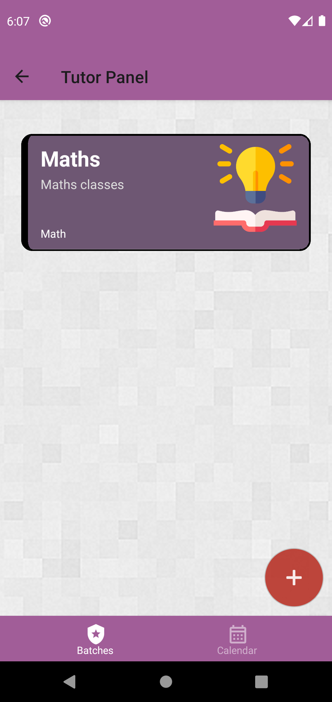
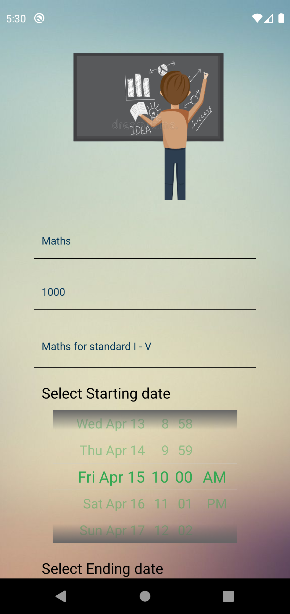
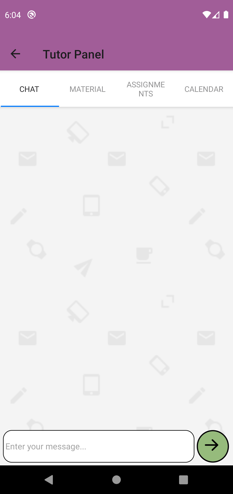
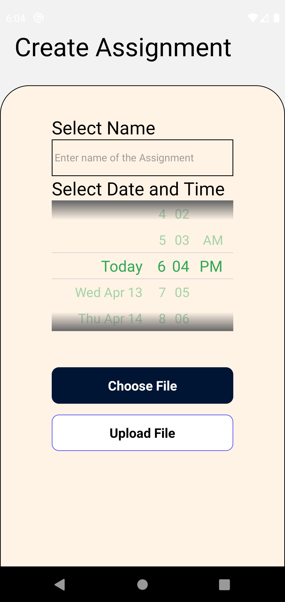
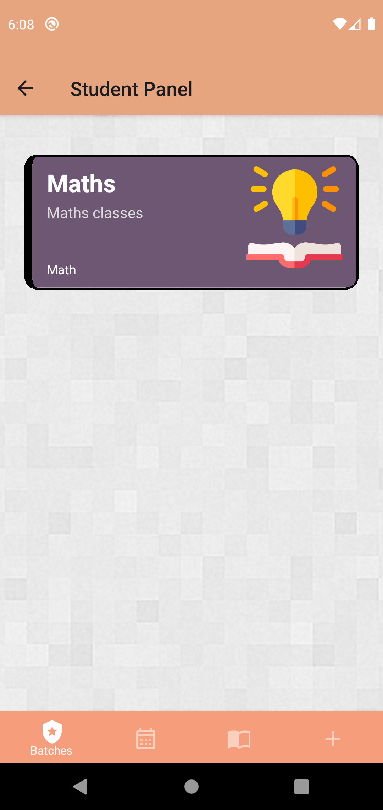

# Tuition
A platform to connect the common people who want to start their own private tuition classes and the students who want some assistance in subjects but cannot afford coaching classes. Tutor can create batches. For particular batch tutor can chat with whole batch, add study materials, schedule assignments with due date. Students can find batches and subscribe to them. For subscribed batches student can chat with other students and tutor, view material and assignment.

Login can be done using email and google with verification sent to email.

Assignments are scheduled using cron-job in backend. Material and chat are all saved in firebase. 

### Backend Link: <a href="https://github.com/Tejas988/Tuition_Backend">Link</a>
# Technology: 
<h3>React Native, Firebase, MongoDB</h3>

# Web App Images:

# Mobile App Images:

